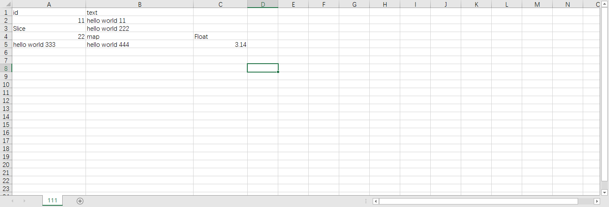

```go

package main

import (
	"fmt"
	"struct2csv/csv"
)

func main() {
	var aa []interface{}
	type Data struct {
		id   int
		text string
	}
	aa = append(aa,
		Data{id: 11, text: "hello world 11"},
		[]string{"Slice", "hello world 222"},
		map[interface{}]interface{}{
			22:      "hello world 333",
			"map":   "hello world 444",
			"Float": 3.1415926,
		},
	)
	if err := csv.ToCsvData("111.csv", aa); err != nil {
		fmt.Println("ToCsvData failed, err: ", err)
		return
	}
}
```

